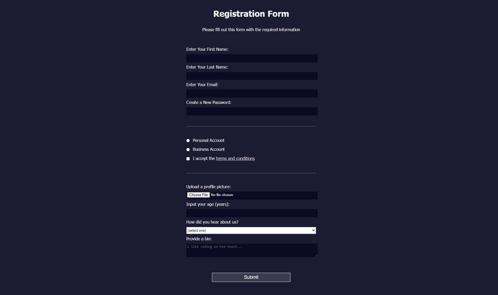

## Registration Form

## Description 
This project was designed to use HTML forms to collect information from users who visit your webpage. In this project, review HTML forms by building a signup page. Learn how to control what types of data users can type into your form, and some new CSS tools for styling! 

## Link
['Kevin Ng Registration Form'](https://kevinng2.github.io/RegistrationForm/)

## Credits
-freeCodeCamp
-Kevin Ng
